# Table of Contents

- [Table of Contents](#table-of-contents)
- [Dex project](#dex-project)
  - [What is a Decentralized Exchange (DEX)?](#what-is-a-decentralized-exchange-dex)
    - [Key Concepts](#key-concepts)
    - [How a DEX Works](#how-a-dex-works)
    - [Detailed Steps](#detailed-steps)
      - [1. Adding Liquidity](#1-adding-liquidity)
      - [2. Swapping Tokens](#2-swapping-tokens)
      - [3. Removing Liquidity](#3-removing-liquidity)
    - [Example DEX: Uniswap](#example-dex-uniswap)
    - [Summary](#summary)
    - [Some Questions and answers](#some-questions-and-answers)
      - [Q1](#q1)
      - [Q2](#q2)
      - [Q3](#q3)
  - [Folder setup](#folder-setup)
- [Dex Contract](#dex-contract)
  - [1. Initialize a Hardhat Project Folder](#1-initialize-a-hardhat-project-folder)
  - [2. Install OpenZeppelin Packages](#2-install-openzeppelin-packages)
  - [3. Configure Environment Variables](#3-configure-environment-variables)
  - [4. Update Hardhat Configuration](#4-update-hardhat-configuration)
  - [5. Contract Development](#5-contract-development)
  - [6. Contract Deployment:](#6-contract-deployment)
    - [**Shortcut: using RemixIDE**](#shortcut-using-remixide)
    - [**Using Hardhat and OpenZeppelin Defender:**](#using-hardhat-and-openzeppelin-defender)
- [Dex UI](#dex-ui)
  - [Initialize a vite react project with TypeScript as language](#initialize-a-vite-react-project-with-typescript-as-language)
  - [Install Chakra UI dependencies, React Icons, Redux, Ethers, Github Pages](#install-chakra-ui-dependencies-react-icons-redux-ethers-github-pages)
  - [Develop components needed for DEX and create a redux store as needed](#develop-components-needed-for-dex-and-create-a-redux-store-as-needed)
    - [EXAMPLE DAPP (NOT ACTUAL PROJECT CODE)](#example-dapp-not-actual-project-code)
    - [1. **Connect to Ethereum with Ethers**](#1-connect-to-ethereum-with-ethers)
    - [2. **Create Blockchain Interaction Components**](#2-create-blockchain-interaction-components)
    - [3. **Handle Token and Liquidity Interactions**](#3-handle-token-and-liquidity-interactions)
    - [4. **Redux Store for Blockchain State Management**](#4-redux-store-for-blockchain-state-management)
  - [Blockchain Data preparation](#blockchain-data-preparation)
    - [ABI and ADDRESS data](#abi-and-address-data)
    - [Public node RPC provider setup](#public-node-rpc-provider-setup)
      - [1. Get an Alchemy API Key](#1-get-an-alchemy-api-key)
      - [2. Set Up the Alchemy Provider](#2-set-up-the-alchemy-provider)
  - [Modifying/Creating global.d.ts to include ethereum in Window object](#modifyingcreating-globaldts-to-include-ethereum-in-window-object)
  - [Metamask Error Type to handle exceptions](#metamask-error-type-to-handle-exceptions)
  - [Ether JS Service to make type conversions](#ether-js-service-to-make-type-conversions)
    - [**Explanation of the Utility Service**](#explanation-of-the-utility-service)
  - [Ether JS Service to interact with Smart Contract](#ether-js-service-to-interact-with-smart-contract)
    - [**Service Overview**](#service-overview)
    - [**Code Implementation**](#code-implementation)
    - [**Summary**](#summary-1)
  - [Refresh Blockchain data](#refresh-blockchain-data)
    - [**Code Implementation**](#code-implementation-1)
    - [**Summary**](#summary-2)
  - [Header Component](#header-component)
  - [Info Component](#info-component)
  - [Swap Component](#swap-component)
  - [Liquidity Component](#liquidity-component)

# Dex project

- The idea is to develop a Decentralized Exchange for our crypto currency that we just released during our previous project.
- The target network is Sepolia.
- We use hardhat and openzeppelin defender for developing and deploying the DEX smart contract.
- We use React JS app as our frontend.

## What is a Decentralized Exchange (DEX)?

A decentralized exchange (DEX) is a platform that allows users to trade cryptocurrencies directly with each other without the need for a centralized intermediary (like a traditional exchange). DEXs use smart contracts to facilitate trades and manage liquidity pools.

### Key Concepts

1. **Liquidity Pool**:

   - A liquidity pool is a collection of funds locked in a smart contract.
   - It consists of two types of assets (e.g., ETH and a token).
   - Liquidity providers (LPs) add funds to the pool and receive liquidity tokens (LP tokens) in return, representing their share in the pool.

2. **Liquidity Provider (LP)**:

   - An LP is a user who adds assets to a liquidity pool.
   - In return, they receive LP tokens.
   - LPs earn fees from trades that occur within the pool.

3. **Liquidity Tokens (LP Tokens)**:

   - These tokens represent a user's share of the liquidity pool.
   - They can be redeemed for the underlying assets in the pool.

4. **Automated Market Maker (AMM)**:
   - An AMM is a protocol that determines the price of assets in a pool using a mathematical formula.
   - The most common formula is the constant product formula: \( x . y = k \), where \( x \) and \( y \) are the quantities of the two assets, and \( k \) is a constant.

### How a DEX Works

1. **Adding Liquidity**:

   - Users deposit an equal value of two assets into the liquidity pool (e.g., ETH and DAI).
   - In return, they receive LP tokens proportional to their contribution.
   - Example: If you add 1 ETH and 2000 DAI to a pool where the current price of ETH is 2000 DAI, you receive LP tokens representing your share.

2. **Swapping Tokens**:

   - Users can trade one asset for another within the pool.
   - The trade is executed by the AMM, which adjusts the asset ratios in the pool.
   - Example: If you swap 1 ETH for DAI, the pool now has more ETH and less DAI, and the price of token in the pool increases slightly due to the constant product formula.

3. **Removing Liquidity**:
   - LPs can redeem their LP tokens to withdraw their share of the pool.
   - They receive their initial assets plus any fees earned from trades.
   - Example: If you remove your liquidity, you get back your ETH and DAI based on the current pool ratio.

### Detailed Steps

#### 1. Adding Liquidity

When a user adds liquidity:

- They provide an equal value of both assets.
- The smart contract mints LP tokens based on the added liquidity.
- Example:
  - Initial state: Pool has 10 ETH and 20000 DAI (1 ETH = 2000 DAI).
  - User adds 1 ETH and 2000 DAI.
  - Pool now has 11 ETH and 22000 DAI.
  - User receives LP tokens representing their contribution (e.g., 10% of the pool).

#### 2. Swapping Tokens

When a user swaps tokens:

- They send one type of asset to the pool and receive the other.
- The AMM adjusts the ratios to maintain the constant product.
- Example:
  - User wants to swap 1 ETH for DAI.
  - Pool has 11 ETH and 22000 DAI.
  - After the swap: Pool has 12 ETH and 20000 DAI.
  - The price of ETH in the pool increases because the ratio of ETH to DAI has changed.

#### 3. Removing Liquidity

When an LP removes liquidity:

- They return their LP tokens to the contract.
- The contract calculates their share and returns the corresponding assets.
- Example:
  - User holds LP tokens representing 10% of the pool.
  - Pool has 12 ETH and 24000 DAI.
  - User removes liquidity and receives 1.2 ETH and 2400 DAI (10% of the pool).

### Example DEX: Uniswap

Uniswap is a popular DEX that uses the constant product formula \( x . y = k \) to determine prices.

- **Formula**: \( x \) is the amount of ETH, \( y \) is the amount of the token, and \( k \) is a constant.
- If a user wants to trade ETH for DAI, they add ETH to the pool and receive DAI in return.
- The new ratio determines the updated price.

### Summary

1. **Add Liquidity**: Provide equal value of two assets → receive LP tokens.
2. **Swap Tokens**: Trade one asset for another → pool ratios adjust, prices change.
3. **Remove Liquidity**: Redeem LP tokens → receive underlying assets and fees.

Understanding these concepts will help you grasp how DEXs like Uniswap, SushiSwap, and others operate. If you have specific questions or need more detailed explanations on any part, feel free to ask!

### Some Questions and answers

---

#### Q1

**_1. Lets say, we deployed the simple dex. And as the founder of some token I add liquidity of 10 ETH and 20000 tokens. Now what is the ETH price and token price? Also lets say someone tomorrow swaps 1 ETH. Now what is the ETH price and token price?_**

You, as the founder, add 10 ETH and 20,000 tokens to the liquidity pool.

1. **Initial State of the Pool:**
   - ETH in pool: 10 ETH
   - Tokens in pool: 20,000 tokens
   - The price of 1 ETH in terms of tokens can be calculated as:


    - The price of 1 token in terms of ETH can be calculated as:

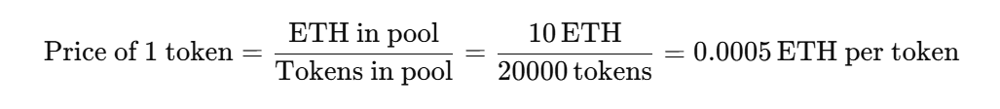

A user swaps 1 ETH for tokens.

2. **State of the Pool After the Swap:**

   - New ETH in pool: 10 ETH + 1 ETH = 11 ETH
   - New tokens in pool: 20,000 tokens - tokens bought
   - We use the constant product formula to find out how many tokens the user receives. The constant product \(k\) remains the same:


- After the swap:

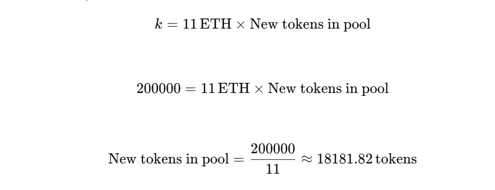

- Tokens bought by the user:


1. **New Prices After the Swap:**
   - The price of 1 ETH in terms of tokens:


- The price of 1 token in terms of ETH:

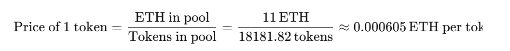

**Summary of the Steps**

1. **Initial State:**

   - ETH in pool: 10 ETH
   - Tokens in pool: 20,000 tokens
   - Price of 1 ETH: 2000 tokens
   - Price of 1 token: 0.0005 ETH

2. **After Swapping 1 ETH:**
   - ETH in pool: 11 ETH
   - Tokens in pool: ~18,181.82 tokens
   - Price of 1 ETH: ~1652.89 tokens
   - Price of 1 token: ~0.000605 ETH

These calculations demonstrate how the constant product formula maintains the balance of the liquidity pool and adjusts prices dynamically based on the supply and demand of each asset.

---

#### Q2

**_2. As the founder of token I add liquidity 10 ETH and 20000 tokens. How much LP I received here?_**

When you initially add liquidity to a new liquidity pool, you typically receive liquidity provider (LP) tokens that represent your share of the pool. The amount of LP tokens you receive is proportional to the amount of liquidity you add.

When you add 10 ETH and 20,000 tokens to a brand-new pool, you set the initial liquidity, and you'll receive LP tokens equivalent to your contribution.

Let's walk through the steps:

1. **Initial Liquidity Provision**:

   - You add 10 ETH and 20,000 tokens to the pool.

2. **Determining the Initial LP Tokens**:
   - Since this is the initial liquidity, there are no existing LP tokens.
   - Typically, the first liquidity provider receives LP tokens equal to the geometric mean of the amounts of the two assets added.
   - In many implementations, the initial LP tokens issued can be set to the total liquidity added (i.e., in units of one of the assets).

For simplicity, let's assume the LP tokens are equal to the total amount of liquidity added in terms of ETH (or the token value).

**Calculation:**

- **Liquidity in terms of ETH**: 10 ETH
- **Liquidity in terms of Tokens**: 20,000 tokens
- The initial LP tokens you receive could be represented by the total value in terms of one asset (e.g., ETH).

In many AMM models (like Uniswap V2), the first liquidity provider sets the initial value of LP tokens to match the geometric mean of the two added assets:

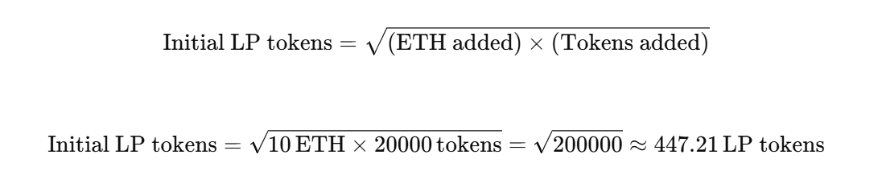

When you add 10 ETH and 20,000 tokens to the pool, you receive approximately 447.21 LP tokens, representing your share of the pool. This value ensures that the product of ETH and tokens in the pool remains consistent with the constant product formula used in AMMs.

---

#### Q3

**_3. Now I have 447.21 LP tokens. Someone else provided liquidity as well, let's say 1 ETH and 4000 tokens. after a week, some swapping occurs, like txn 1: 1 ETH swapped, txn 2: 1000 tokens swapped. Now I want to redeem my 447.21 LP tokens. What will I receive?_**

1. **Initial Liquidity Added by You**:

   - ETH in pool: 10 ETH
   - Tokens in pool: 20,000 tokens
   - LP tokens issued to you: 447.21 LP tokens

2. **Additional Liquidity Added by Another User**:
   - Additional ETH: 1 ETH
   - Additional tokens: 4,000 tokens
   - Total ETH in pool: 10 ETH + 1 ETH = 11 ETH
   - Total tokens in pool: 20,000 tokens + 4,000 tokens = 24,000 tokens
   - New LP tokens issued to the second user:

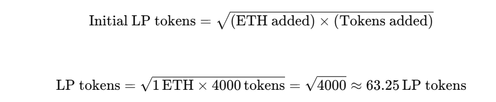

    - Total LP tokens in circulation: 447.21 LP tokens (yours) + 63.25 LP tokens (theirs) = 510.46 LP tokens

3. **Transactions Occur**:
   - **Transaction 1: 1 ETH swapped for tokens**:
     - New ETH in pool: 11 ETH + 1 ETH = 12 ETH
     - Let \(y\) be the new token balance in the pool.

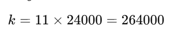

     - After the swap:

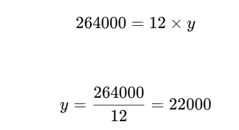

     - Tokens received by the user:

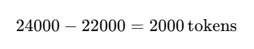

     - Pool after first transaction:
          - ETH in pool: 12 ETH
          - Tokens in pool: 22,000 tokens

- **Transaction 2: 1000 tokens swapped for ETH** :
  - New tokens in pool: 22,000 tokens + 1000 tokens = 23,000 tokens
  - Let \(x\) be the new ETH balance in the pool.

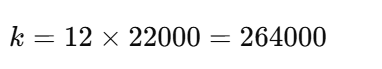

      - After the swap:

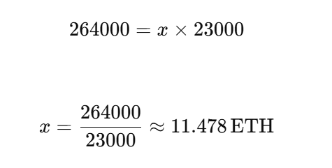

      - ETH received by the user:

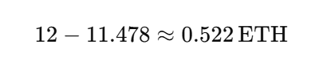

      - Pool after second transaction:
          - ETH in pool: 11.478 ETH
          - Tokens in pool: 23,000 tokens

4. **Redeem Your LP Tokens**:
   - Total LP tokens in circulation: 510.46 LP tokens
   - Your share of the pool:

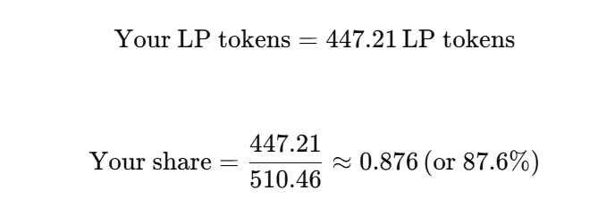

    - Your share of the remaining pool:

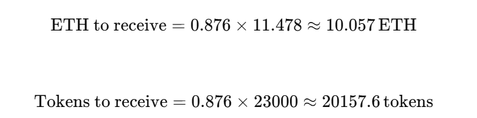

5. **Summary**:

When you redeem your 447.21 LP tokens, you will receive approximately:

- **10.057 ETH**
- **20,157.6 tokens**

These amounts represent your share of the liquidity pool after all transactions have been completed.

---

## Folder setup

- There are two separate projects
  1. Smart contract management (dex-contract)
  2. Frontend (dex-ui)
- Both these projects are under a common folder (Dex Project) for simplicity.

# Dex Contract

## 1. Initialize a Hardhat Project Folder

- Create root folder. Initialize hardhat project.

```bash
mkdir dex-contract && cd dex-contract && npx hardhat init
# select typescript when prompted
```

## 2. Install OpenZeppelin Packages

- Install the necessary OpenZeppelin packages for developing upgradeable contracts and managing environment variables.

```bash
npm install --save-dev @openzeppelin/hardhat-upgrades @openzeppelin/contracts-upgradeable dotenv
```

## 3. Configure Environment Variables

Create a new file called `.env` in the project root directory and add the following content with the keys you received after creating the Defender environment:

```plaintext
DEFENDER_KEY = "<<YOUR_KEY>>"
DEFENDER_SECRET = "<<YOUR_SECRET>>"
OWNER_ADDRESS = "<<YOUR_METAMASK_OR_ANY_WALLET_ADDRESS>>"
TOKEN_ADDRESS = "<<YOUR_TOKEN_CONTRACT_ADDRESS>>"
```

Replace `<<YOUR_KEY>>` and `<<YOUR_SECRET>>` with your actual Defender key and secret.
Replace `<<YOUR_METAMASK_OR_ANY_WALLET_ADDRESS>>` with your wallet address.
Replace `<<YOUR_TOKEN_CONTRACT_ADDRESS>>` with the token address you want to swap ETH with.

## 4. Update Hardhat Configuration

You need to edit your Hardhat configuration to add the Defender keys and Sepolia network. Open the `hardhat.config.ts` file and replace its content with the following code:

```ts
import { HardhatUserConfig } from "hardhat/config";
import "@nomicfoundation/hardhat-toolbox";
import "@openzeppelin/hardhat-upgrades";

require("dotenv").config();

const config: HardhatUserConfig = {
  solidity: "0.8.24",
  defender: {
    apiKey: process.env.DEFENDER_KEY as string,
    apiSecret: process.env.DEFENDER_SECRET as string,
  },
  networks: {
    sepolia: {
      url: "https://ethereum-sepolia.publicnode.com",
      chainId: 11155111,
    },
  },
};

export default config;
```

## 5. Contract Development

- After creation, lets write the smart contract in the hardhat contract folder

```ts
// SPDX-License-Identifier: MIT
pragma solidity ^0.8.0;

import "@openzeppelin/contracts/token/ERC20/IERC20.sol";
import "@openzeppelin/contracts/access/Ownable.sol";
import "@openzeppelin/contracts/token/ERC20/ERC20.sol";

// Simple Decentralized Exchange (DEX) contract
contract SimpleDEX is Ownable, ERC20 {
    // ERC20 token interface to interact with the specified token
    IERC20 public token;

    // Event to log swap transactions
    event Swap(
        address indexed user,
        address indexed fromToken,
        address indexed toToken,
        uint256 amount
    );

    // Constructor to initialize the contract with the token, name, symbol, and owner
    constructor(
        address _token, // address of the token contract
        string memory _name, // name of the liquidity pool token, not your actual Token name that you intend to deposit
        string memory _symbol, // symbol of the liquidity pool token, not your actual Token name that you intend to deposit
        address initialOwner
    ) ERC20(_name, _symbol) Ownable(initialOwner) {
        token = IERC20(_token); // Set the token
    }

    // Function to get the number of tokens held by the contract
    function getTokensInContract() public view returns (uint256) {
        return token.balanceOf(address(this));
    }

    // Function to get the number of ETH held by the contract
    function getETHsInContract() public view returns (uint256) {
        return address(this).balance;
    }

    // Function to add liquidity to the contract
    // _amount: amount of tokens to add
    function addLiquidity(uint256 _amount) public payable returns (uint256) {
        uint256 _liquidity;
        uint256 balanceInEth = getETHsInContract() - msg.value; // Current ETH balance of the contract excluding current deposit
        uint256 tokenReserve = getTokensInContract(); // Current token balance of the contract

        // If there's no token reserve, initialize the liquidity pool
        if (tokenReserve == 0) {
            require(msg.value > 0, "Must send ETH to add liquidity");
            require(_amount > 0, "Must send tokens to add liquidity");
            token.transferFrom(msg.sender, address(this), _amount); // Transfer tokens from user to contract
            _liquidity = msg.value; // Set initial liquidity to the ETH balance
            _mint(msg.sender, _liquidity); // Mint liquidity tokens to the user
        } else {
            uint256 reservedEth = balanceInEth; // ETH reserve excluding the current deposit
            uint256 reservedTokens = tokenReserve;

            // Calculates how many tokens can be bought for provided ETH value.
            //The number of tokens being sent must be greater than or equal to that many number of tokens.
            require(
                _amount >= (msg.value * reservedTokens) / reservedEth,
                "Amount of tokens sent is less than the minimum tokens required"
            );
            token.transferFrom(msg.sender, address(this), _amount); // Transfer tokens from user to contract
            unchecked {
                // totalSupply() refers to the total number of liquidity tokens that have been minted and are currently in circulation.
                _liquidity = (totalSupply() * msg.value) / reservedEth; // Calculate liquidity to be minted
            }
            _mint(msg.sender, _liquidity); // Mint liquidity tokens to the user
        }
        return _liquidity;
    }

    // Function to remove liquidity from the contract
    // _amount: amount of liquidity tokens to burn
    function removeLiquidity(
        uint256 _amount
    ) public returns (uint256, uint256) {
        require(_amount > 0, "Amount should be greater than zero");
        uint256 _reservedEth = getETHsInContract(); // Current ETH reserve
        uint256 _totalSupply = totalSupply(); // Total supply of liquidity tokens

        // Calculate the amounts of ETH and tokens to be returned to the user
        uint256 _ethAmount = (_reservedEth * _amount) / _totalSupply;
        uint256 _tokenAmount = (getTokensInContract() * _amount) / _totalSupply;
        _burn(msg.sender, _amount); // Burn liquidity tokens from the user
        payable(msg.sender).transfer(_ethAmount); // Transfer ETH to the user
        token.transfer(msg.sender, _tokenAmount); // Transfer tokens to the user
        return (_ethAmount, _tokenAmount);
    }

    // Swap Logic
    // before swap: K = x * y
    // during swap: K' = (x + x') * y'
    // But K must always be a constant so K = K', x*y = (x+x') * y'
    // y' = (x*y)/(x+x')
    // z = y - y'
    // K - constant product
    // x - ETH amount in contract before swap
    // y - token amount before swap
    // x' - new deposit of ETH
    // y' - new amount of token after swap, y' < y always as we release some tokens on swap
    // z - the amount of token release during the swap, which is y - y'

    // Function to calculate the amount of output tokens for a given input amount
    // inputAmount: amount of input tokens
    // inputReserve: reserve of input tokens in the contract
    // outputReserve: reserve of output tokens in the contract
    function getAmountOfTokens(
        uint256 inputAmount,
        uint256 inputReserve,
        uint256 outputReserve
    ) public pure returns (uint256) {
        require(inputReserve > 0 && outputReserve > 0, "Invalid Reserves");
        uint256 inputAmountWithFee = (inputAmount * 99)/100; // Apply a 1% fee
        uint256 numerator = (inputReserve * outputReserve);
        uint256 denominator = (inputAmountWithFee + inputReserve);
        unchecked {
            return outputReserve - (numerator / denominator); // Return the calculated output amount, z = y - y', where y' = (x*y)/(x+x')
        }
    }

    // Function to swap ETH for tokens
    function swapEthToToken() public payable {
        uint256 _tokensBought = getAmountOfTokens(
            msg.value, // x' - New deposit
            getETHsInContract(), // x - ETH reserve before swap
            getTokensInContract() // y - Token reserve before swap
        );
        token.transfer(msg.sender, _tokensBought); // Transfer the bought tokens to the user
        emit Swap(msg.sender, address(0), address(token), _tokensBought);
    }

    // Function to swap tokens for ETH
    // _tokensSold: amount of tokens to sell
    function swapTokenToEth(uint256 _tokensSold) public {

        uint256 ethBought = getAmountOfTokens(
            _tokensSold, // x' - New deposit
            getTokensInContract(), // x - Token reserve before swap
            getETHsInContract() // y - ETH reserve before swap
        );
        token.transferFrom(msg.sender, address(this), _tokensSold); // Transfer tokens from user to contract
        payable(msg.sender).transfer(ethBought); // Transfer the bought ETH to the user
        emit Swap(msg.sender, address(token), address(0), _tokensSold);
    }
}

```

## 6. Contract Deployment:

### **Shortcut: using RemixIDE**

Contract can be deployed easily using [Remix IDE](https://remix.ethereum.org) itself by injecting metamask network (while using sepolia) and note the address where it is deployed (eg: `0x77507F01012fAADec75d796A362fc513a4F1b354`).

### **Using Hardhat and OpenZeppelin Defender:**

- Write a deployment script under `ignition/modules` folder

```ts
// SimpleDEX.ts
import { ethers, defender } from "hardhat";
import readline from "readline";
require("dotenv").config();

const rl = readline.createInterface({
  input: process.stdin,
  output: process.stdout,
});

async function main() {
  const SimpleDEX = await ethers.getContractFactory("SimpleDEX");

  const deployApprovalProcess = await defender.getDeployApprovalProcess();
  if (deployApprovalProcess.address === undefined) {
    throw new Error(
      `Deploy approval process with id ${deployApprovalProcess.approvalProcessId} has no assigned address`
    );
  }
  console.log(
    `Owner of the contract will be ${process.env.OWNER_ADDRESS} and the deployment must be approved by ${deployApprovalProcess.address}`
  );
  console.log(
    `The token selected is deployed in address ${process.env.TOKEN_ADDRESS}`
  );

  rl.question(
    "Do you want to proceed with the deployment? (y/n): ",
    async (answer) => {
      if (answer.toLowerCase() === "y") {
        const deployment = await defender.deployContract(
          SimpleDEX,
          [
            process.env.TOKEN_ADDRESS,
            "SimpleDexLP",
            "SDLP",
            process.env.OWNER_ADDRESS,
          ],
          {
            salt: "0x0000000000000000000000000000000000000000000000000000000029081998",
          }
        );

        await deployment.waitForDeployment();

        console.log(`Contract deployed to ${await deployment.getAddress()}`);
      } else {
        console.log("Deployment cancelled.");
      }

      rl.close();
    }
  );
}

// We recommend this pattern to be able to use async/await everywhere
// and properly handle errors.
main().catch((error) => {
  console.error(error);
  process.exitCode = 1;
});
```

- Now deploy using the command below

```bash
npx hardhat run --network sepolia ignition/modules/SimpleDEX.ts
```

- After running the deployment script, you might see a message like the following:

```text
ACTION REQUIRED: Go to https://defender.openzeppelin.com/v2/#/deploy to submit the pending deployment.
The process will continue automatically when the pending deployment is completed.
Waiting for pending deployment of contract VinciArtTokens with deployment id ffb12781-b5e8-4a15-a0f9-d3fa7ebfe9aa...
```

- Follow these steps:

  1. **Go to OpenZeppelin Defender**: Navigate to the URL provided in the console output.
  2. **Submit the Pending Deployment**: Use your approval process authorized wallet to approve the deployment.

- Once deployment is approved, you should see an output like:

```text
Contract deployed to 0x77507F01012fAADec75d796A362fc513a4F1b354
```

- Navigate to the "Deploy" section in OpenZeppelin Defender and verify that the contract have been deployed in the test environment.

# Dex UI

## Initialize a vite react project with TypeScript as language

```bash
# Initialize a Vite=> React + TypeScript Project
npm create vite@latest dex-ui
# change directory into project folder and install dependencies
cd dex-ui && npm i
# Test application by running dev server
npm run dev
```

## Install Chakra UI dependencies, React Icons, Redux, Ethers, Github Pages


1. **Install Chakra UI and its dependencies:**

   ```bash
   npm i @chakra-ui/react @emotion/react @emotion/styled framer-motion
   ```

   - `@chakra-ui/react`: Chakra UI is a modern component library that helps you build responsive and accessible React applications quickly.
   - `@emotion/react` and `@emotion/styled`: These are libraries for writing CSS styles in JavaScript. Chakra UI uses them for its styling.
   - `framer-motion`: This is a library for animations in React. It's often used with Chakra UI to add smooth transitions and effects.

2. **Install React Icons:**

   ```bash
   npm i react-icons
   ```

   - `react-icons`: This library provides a collection of popular icons from various icon libraries (like FontAwesome, Material Design, etc.) that you can use in your React applications.

3. **Install Redux and its dependencies:**

   ```bash
   npm i react-redux
   ```

   - `react-redux`: This library connects Redux with React, enabling you to use Redux state management in your React components.

4. **Install Ethers:**

   ```bash
   npm i ethers
   ```

   - `ethers`: This is a library for interacting with the Ethereum blockchain. It allows you to connect to public nodes, interact with smart contracts, and work with Ethereum wallets like MetaMask.

5. **Install GitHub Pages for deployment:**

   ```bash
   npm i -D gh-pages
   ```

   - `gh-pages`: This package is used for deploying your React application to GitHub Pages. The `-D` flag installs it as a development dependency, which is typical for deployment tools.

With these installations, you'll have the tools and libraries needed to build a feature-rich React application with responsive UI, state management, blockchain interaction, and deployment capabilities.

## Develop components needed for DEX and create a redux store as needed

- The react development and redux global state management are in itself a separate topic and we don't cover that here
- We will only cover the blockchain related topics of the UI

### EXAMPLE DAPP (NOT ACTUAL PROJECT CODE)
Here's a focused guide on developing components and integrating blockchain interactions:

### 1. **Connect to Ethereum with Ethers**

You'll need to set up the connection to the Ethereum network and MetaMask. Create a utility file, say `ethersUtils.ts`, for managing Ethereum interactions:

```typescript
// ethersUtils.ts
import { ethers } from 'ethers';

let provider: ethers.providers.Web3Provider;
let signer: ethers.Signer;

export async function connectWallet() {
  if (window.ethereum) {
    provider = new ethers.providers.Web3Provider(window.ethereum);
    await provider.send("eth_requestAccounts", []);
    signer = provider.getSigner();
    return { provider, signer };
  } else {
    throw new Error("No crypto wallet found. Please install it.");
  }
}

export function getProvider() {
  return provider;
}

export function getSigner() {
  return signer;
}
```

### 2. **Create Blockchain Interaction Components**

- **ConnectButton Component**: This will allow users to connect their MetaMask wallet.

  ```typescript
  // ConnectButton.tsx
  import React, { useState } from 'react';
  import { connectWallet } from './ethersUtils';

  const ConnectButton: React.FC = () => {
    const [connected, setConnected] = useState(false);

    const handleConnect = async () => {
      try {
        await connectWallet();
        setConnected(true);
      } catch (error) {
        console.error(error);
      }
    };

    return (
      <button onClick={handleConnect}>
        {connected ? 'Wallet Connected' : 'Connect Wallet'}
      </button>
    );
  };

  export default ConnectButton;
  ```

- **DisplayAccount Component**: This will display the connected user's Ethereum address.

  ```typescript
  // DisplayAccount.tsx
  import React, { useEffect, useState } from 'react';
  import { getSigner } from './ethersUtils';

  const DisplayAccount: React.FC = () => {
    const [address, setAddress] = useState<string | null>(null);

    useEffect(() => {
      const fetchAddress = async () => {
        const signer = getSigner();
        if (signer) {
          const address = await signer.getAddress();
          setAddress(address);
        }
      };
      fetchAddress();
    }, []);

    return <div>{address ? `Address: ${address}` : 'No wallet connected'}</div>;
  };

  export default DisplayAccount;
  ```

### 3. **Handle Token and Liquidity Interactions**

- **Token Balance Component**: Fetch and display token balances.

  ```typescript
  // TokenBalance.tsx
  import React, { useEffect, useState } from 'react';
  import { getSigner } from './ethersUtils';
  import { Contract } from 'ethers';

  const TOKEN_CONTRACT_ADDRESS = 'your_token_contract_address';
  const TOKEN_ABI = [
    // Your token ABI here
    "function balanceOf(address owner) view returns (uint256)"
  ];

  const TokenBalance: React.FC<{ tokenAddress: string }> = ({ tokenAddress }) => {
    const [balance, setBalance] = useState<string | null>(null);

    useEffect(() => {
      const fetchBalance = async () => {
        const signer = getSigner();
        const contract = new Contract(tokenAddress, TOKEN_ABI, signer);
        const balance = await contract.balanceOf(await signer.getAddress());
        setBalance(ethers.utils.formatUnits(balance, 18)); // Adjust decimals as needed
      };
      fetchBalance();
    }, [tokenAddress]);

    return <div>Token Balance: {balance ?? 'Loading...'}</div>;
  };

  export default TokenBalance;
  ```

### 4. **Redux Store for Blockchain State Management**

For blockchain-related state management with Redux, you might want to store user wallet details, token balances, and other relevant data.

Here's a basic example of how you could set up your Redux store:

- **actions.ts**

  ```typescript
  // actions.ts
  export const SET_WALLET_ADDRESS = 'SET_WALLET_ADDRESS';
  export const SET_TOKEN_BALANCE = 'SET_TOKEN_BALANCE';

  export const setWalletAddress = (address: string) => ({
    type: SET_WALLET_ADDRESS,
    payload: address,
  });

  export const setTokenBalance = (balance: string) => ({
    type: SET_TOKEN_BALANCE,
    payload: balance,
  });
  ```

- **reducer.ts**

  ```typescript
  // reducer.ts
  import { SET_WALLET_ADDRESS, SET_TOKEN_BALANCE } from './actions';

  const initialState = {
    walletAddress: null,
    tokenBalance: null,
  };

  const reducer = (state = initialState, action: any) => {
    switch (action.type) {
      case SET_WALLET_ADDRESS:
        return { ...state, walletAddress: action.payload };
      case SET_TOKEN_BALANCE:
        return { ...state, tokenBalance: action.payload };
      default:
        return state;
    }
  };

  export default reducer;
  ```

- **store.ts**

  ```typescript
  // store.ts
  import { createStore } from 'redux';
  import reducer from './reducer';

  const store = createStore(reducer);

  export default store;
  ```

With this setup, you can manage blockchain-related state in your Redux store and interact with Ethereum using the components and utilities provided.


## Blockchain Data preparation

### ABI and ADDRESS data

- create a .ts file for storing the address and abi of dex contract and your custom token contract

```ts
// dex-ui\src\blockchainData\blockchainData.ts
export const SIMPLE_DEX_ADDRESS = "Your dex contract address here";
export const SIMPLE_DEX_ABI = ["Your dex contract abi here"];
export const NCT_CONTRACT_ADDRESS = "Your token contract address here";
export const NCT_CONTRACT_ABI = ["Your token contract abi here];
```

### Public node RPC provider setup

- This is required to display read only or publicly available data from contracts
- This allows even users without a wallet can access the contract data
- There are many public node providers like Alchemy, Infura etc.,
- We go with Alchemy in this project

To use the Alchemy provider in your application, you'll need to follow these steps:

1. **Get an Alchemy API Key**: Sign up on [Alchemy's website](https://www.alchemy.com) and create a project to get your API key.

2. **Set Up the Alchemy Provider**: Initialize the provider using the Alchemy URL with your API key.

3. **Update the Service**: Use the Alchemy provider in your `SimpleDexService` for read-only operations.

#### 1. Get an Alchemy API Key

Go to [Alchemy's Dashboard](https://dashboard.alchemy.com) and create a new app to get your API key. You'll need this key to access the Ethereum network via Alchemy.

#### 2. Set Up the Alchemy Provider

Create a file to set up the Alchemy provider. For example, you might create `alchemyProvider.ts`.

```typescript
// dex-ui\src\blockchainData\alchemyProvider.ts

import { ethers } from "ethers";

const ALCHEMY_URL = `https://eth-sepolia.g.alchemy.com/v2/Pl6KGMMMQQNTAs4Fz_CqxcNpcP6_DQ-U`;

const alchemyProvider = new ethers.JsonRpcProvider(ALCHEMY_URL);

export default alchemyProvider;
```

## Modifying/Creating global.d.ts to include ethereum in Window object

```ts
// src/global.d.ts

// Importing Eip1193Provider from ethers library
import { Eip1193Provider } from "ethers";

// Declaring global types to extend the Window interface
declare global {
  // Extending the Window interface to include `ethereum` property
  interface Window {
    // `ethereum` is an instance of Eip1193Provider, which is an interface for Ethereum provider
    ethereum: Eip1193Provider;
  }
}

// Note: The `Eip1193Provider` interface typically represents an Ethereum provider object,
// such as MetaMask, which allows web applications to interact with the Ethereum blockchain.
// By extending the Window interface, we can safely access `window.ethereum` throughout
// the application without TypeScript errors.
```

## Metamask Error Type to handle exceptions

```ts
// dex-ui\src\types\MetamaskError.type.ts
// Define a type for MetaMask-related errors
type MetaMaskError = {
  // Numeric error code specific to MetaMask errors
  code: number;

  // Descriptive message providing details about the error
  message: string;

  // Optional field for additional data related to the error, if any
  data?: unknown;
};

export default MetaMaskError;
```

## Ether JS Service to make type conversions


When working with blockchain data, regular JavaScript types (like numbers) often aren't sufficient due to the large scale of values involved. Instead, specialized types and conversions are necessary. For instance, the Ethereum blockchain typically uses `BigNumberish` types to handle large numbers, which can be represented as `BigNumber` objects or strings.

To handle these conversions effectively, it's helpful to write a dedicated service. This service will provide utility functions to convert between blockchain-specific types and regular JavaScript types, ensuring accurate and meaningful calculations and representations.

Here's an example of such a service:

```typescript
// dex-ui\src\services\UtilityService.ts
import { ethers } from "ethers";

class UtilityService {
  constructor() {}

  // Convert a BigNumberish value to a float with 18 decimal places
  public convertBigIntToFloat(input: ethers.BigNumberish): number {
    // Convert BigNumberish to string and then parse it to float with 18 decimal places
    return parseFloat(ethers.formatUnits(input, 18));
  }

  // Convert a float to a BigNumberish value with 18 decimal places
  public convertFloatToBigInt(input: number): ethers.BigNumberish {
    // Convert float to string and then parse it to BigNumberish with 18 decimal places
    return ethers.parseUnits(input.toString(), 18);
  }

  // Convert a BigNumberish value to a number
  public convertBigIntToNumber(input: ethers.BigNumberish): number {
    // Convert BigNumberish to number
    return ethers.toNumber(input);
  }

  // Calculate the output amount of tokens for a given input amount using the constant product formula
  public calculateSwapOutputAmount(
    inputAmount: number,
    inputReserve: number,
    outputReserve: number
  ) {
    // Apply a 1% fee on the input amount
    inputAmount *= 0.99;
    // Calculate the output reserve after the swap
    const afterSwapOutputReserve =
      (inputReserve * outputReserve) / (inputAmount + inputReserve);
    // Calculate and return the output amount
    return outputReserve - afterSwapOutputReserve;
  }

  // Calculate the amount of ETH and tokens to be redeemed for a given liquidity amount
  public calculateRedeemOutput(
    liquidityAmount: number,
    liquidityInCirculation: number,
    ethReserve: number,
    tokenReserve: number
  ): { ethAmount: number; tokenAmount: number } {
    // Check for invalid liquidity amount
    if (liquidityAmount < 0) {
      throw new Error("Invalid liquidity amount or total supply");
    }

    // Calculate the amount of ETH to be redeemed
    const ethAmount = (ethReserve * liquidityAmount) / liquidityInCirculation;
    // Calculate the amount of tokens to be redeemed
    const tokenAmount =
      (tokenReserve * liquidityAmount) / liquidityInCirculation;

    // Return the calculated ETH and token amounts
    return { ethAmount, tokenAmount };
  }
}

// Create and export an instance of the UtilityService class
const utilityService = new UtilityService();
export default utilityService;
```

### **Explanation of the Utility Service**

1. **Conversion Methods**:
   - **`convertBigIntToFloat`**: Converts a `BigNumberish` (which can be a `BigNumber`, string, or other types) to a JavaScript float. This is useful for displaying values to users in a readable format.
   - **`convertFloatToBigInt`**: Converts a JavaScript float to a `BigNumberish` type. This is useful for interacting with smart contracts, which require `BigNumberish` types for large values.
   - **`convertBigIntToNumber`**: Converts a `BigNumberish` to a regular JavaScript number. This method may be used for simple calculations where the precision of a `BigNumber` is not required.

2. **Calculation Methods**:
   - **`calculateSwapOutputAmount`**: Implements the constant product formula for a decentralized exchange (DEX) swap. It calculates how much of a token will be received based on the input amount and reserves. It also accounts for a transaction fee by reducing the input amount by 1%.
   - **`calculateRedeemOutput`**: Determines how much ETH and tokens a user will receive when redeeming liquidity. This calculation is based on the amount of liquidity being redeemed and the total liquidity in circulation.

3. **Exported Instance**:
   - An instance of `UtilityService` is created and exported. This allows the service's methods to be used throughout your application to handle blockchain data and perform necessary conversions and calculations.

This service helps manage and manipulate blockchain data effectively, making it easier to work with large numbers and perform accurate calculations.

## Ether JS Service to interact with Smart Contract

To interact with smart contracts on the Ethereum blockchain, you need a service that facilitates the execution of contract methods and handles transactions. This service leverages the `ethers.js` library to interact with smart contracts, perform transactions, and retrieve blockchain data. Here’s how you can set up such a service:

### **Service Overview**

This `SimpleDexService` class provides methods to interact with both the decentralized exchange (DEX) contract and a token contract. It includes functions for performing transactions (like adding or removing liquidity) and reading data from the contracts (like token balances and contract owner).

1. **Class Initialization**:
   - **Provider and Signer**: The `provider` is used for interacting with the Ethereum network (e.g., reading data). The `signer` is optional and used for sending transactions that require authorization.
   - **Contract Instances**: The class initializes contract instances for the DEX and token using their respective ABI and address.

2. **State Change Services**:
   - Methods for performing transactions that alter the state of the blockchain. These include adding/removing liquidity and swapping tokens.

3. **Read-Only Services**:
   - Methods for querying data from the blockchain without altering its state. These include fetching token balances, contract ownership, and token details.

4. **General Blockchain Services**:
   - Utility functions that handle common blockchain operations, such as waiting for a transaction to be mined.

### **Code Implementation**

```typescript
// dex-ui\src\services\SimpleDexService.ts
import { ethers } from "ethers";
import {
  SIMPLE_DEX_ABI,
  SIMPLE_DEX_ADDRESS,
  NCT_CONTRACT_ADDRESS,
  NCT_CONTRACT_ABI,
} from "../blockchainData/blockchainData";

class SimpleDexService {
  private provider: ethers.Provider | ethers.BrowserProvider;
  private signer?: ethers.Signer;
  private simpleDEXContract!: ethers.Contract;
  private tokenContract!: ethers.Contract;

  constructor(
    provider: ethers.Provider | ethers.BrowserProvider,
    signer?: ethers.Signer
  ) {
    // Set the provider for interacting with the blockchain
    this.provider = provider;
    // Optional signer for executing transactions that require authorization
    this.signer = signer;
    // Initialize the DEX contract instance with the provided ABI and address
    // Use signer if available for transactions, otherwise use provider for read-only operations
    this.simpleDEXContract = new ethers.Contract(
      SIMPLE_DEX_ADDRESS,
      SIMPLE_DEX_ABI,
      this.signer || this.provider
    );
    // Initialize the token contract instance with the provided ABI and address
    this.tokenContract = new ethers.Contract(
      NCT_CONTRACT_ADDRESS,
      NCT_CONTRACT_ABI,
      this.signer || this.provider
    );
  }

  // STATE CHANGE SERVICES

  // Add liquidity to the contract
  async addLiquidity(
    tokenAmount: ethers.BigNumberish,
    ethAmount: ethers.BigNumberish
  ): Promise<ethers.TransactionResponse> {
    // Approve the DEX contract to transfer the specified token amount on behalf of the user
    const approveTx = await this.tokenContract.approve(
      SIMPLE_DEX_ADDRESS,
      tokenAmount
    );
    // Wait for the approval transaction to be mined
    await approveTx.wait();
    // Call the addLiquidity function on the DEX contract with the specified token and ETH amounts
    return this.simpleDEXContract.addLiquidity(tokenAmount, {
      value: ethAmount,
    });
  }

  // Remove liquidity from the contract
  async removeLiquidity(
    liquidityAmount: ethers.BigNumberish
  ): Promise<ethers.TransactionResponse> {
    // Call the removeLiquidity function on the DEX contract with the specified liquidity amount
    return this.simpleDEXContract.removeLiquidity(liquidityAmount);
  }

  // Swap ETH for tokens
  async swapEthToToken(
    ethAmount: ethers.BigNumberish
  ): Promise<ethers.TransactionResponse> {
    // Call the swapEthToToken function on the DEX contract with the specified ETH amount
    return this.simpleDEXContract.swapEthToToken({ value: ethAmount });
  }

  // Swap tokens for ETH
  async swapTokenToEth(
    tokenAmount: ethers.BigNumberish
  ): Promise<ethers.TransactionResponse> {
    // Approve the DEX contract to transfer the specified token amount on behalf of the user
    const approveTx = await this.tokenContract.approve(
      SIMPLE_DEX_ADDRESS,
      tokenAmount
    );
    // Wait for the approval transaction to be mined
    await approveTx.wait();
    // Call the swapTokenToEth function on the DEX contract with the specified token amount
    return this.simpleDEXContract.swapTokenToEth(tokenAmount);
  }

  // Get the amount of output tokens for a given input amount
  async getAmountOfTokens(
    inputAmount: ethers.BigNumberish,
    inputReserve: ethers.BigNumberish,
    outputReserve: ethers.BigNumberish
  ): Promise<ethers.BigNumberish> {
    // Call the getAmountOfTokens function on the DEX contract with the specified input amount, input reserve, and output reserve
    return this.simpleDEXContract.getAmountOfTokens(
      inputAmount,
      inputReserve,
      outputReserve
    );
  }

  // READ ONLY SERVICES

  // Get the number of tokens held by the contract
  async getTokensInContract(): Promise<ethers.BigNumberish> {
    // Call the getTokensInContract function on the DEX contract
    return this.simpleDEXContract.getTokensInContract();
  }

  // Get the number of ETH held by the contract
  async getETHsInContract(): Promise<ethers.BigNumberish> {
    // Call the getETHsInContract function on the DEX contract
    return this.simpleDEXContract.getETHsInContract();
  }

  // Get the owner of the contract
  async getOwner(): Promise<string> {
    // Call the owner function on the DEX contract
    return await this.simpleDEXContract.owner();
  }

  // Get the symbol of the token
  async getSymbol(): Promise<string> {
    // Call the symbol function on the token contract
    return await this.simpleDEXContract.symbol();
  }

  // Get the name of the token
  async getName(): Promise<string> {
    // Call the name function on the token contract
    return await this.simpleDEXContract.name();
  }

  // Get the total supply of the token
  async getTotalSupply(): Promise<ethers.BigNumberish> {
    // Call the totalSupply function on the DEX contract
    return await this.simpleDEXContract.totalSupply();
  }

  // Get the decimals of the token
  async getDecimals(): Promise<number> {
    // Call the decimals function on the token contract
    return await this.simpleDEXContract.decimals();
  }

  // NON CONTRACT OR GENERAL BLOCKCHAIN SERVICES

  // Wait for a transaction to be mined and check its status
  async waitForTransaction(hash: string) {
    let result = false;
    try {
      // Wait for the transaction with the specified hash to be mined
      const receipt = await this.provider.waitForTransaction(hash);
      // Check the status of the transaction receipt
      if (receipt && receipt.status === 1) {
        result = true;
      } else {
        // Throw an error if the transaction failed
        throw new Error("Transaction failed");
      }
    } catch (err) {
      // Log and rethrow any errors that occur while waiting for the transaction
      console.error("Error waiting for transaction:", err);
      throw err;
    } finally {
      // Return the result indicating whether the transaction succeeded
      return result;
    }
  }
}

export default SimpleDexService;
```

### **Summary**

1. **State Change Services**:
   - **`addLiquidity`**: Adds liquidity to the DEX by approving the contract to spend the user’s tokens and then calling the `addLiquidity` function on the DEX contract.
   - **`removeLiquidity`**: Removes liquidity from the DEX by calling the `removeLiquidity` function on the DEX contract.
   - **`swapEthToToken`**: Swaps ETH for tokens by calling the `swapEthToToken` function on the DEX contract.
   - **`swapTokenToEth`**: Swaps tokens for ETH by first approving the DEX contract to spend the tokens and then calling the `swapTokenToEth` function on the DEX contract.
   - **`getAmountOfTokens`**: Retrieves the amount of output tokens based on a given input amount using the DEX contract's method.

2. **Read-Only Services**:
   - **`getTokensInContract`**: Fetches the total number of tokens held by the DEX contract.
   - **`getETHsInContract`**: Fetches the total amount of ETH held by the DEX contract.
   - **`getOwner`**: Retrieves the owner of the DEX contract.
   - **`getSymbol`**, **`getName`**, **`getTotalSupply`**, **`getDecimals`**: These methods retrieve various properties of the token from the token contract, such as its symbol, name, total supply, and decimal precision.

3. **General Blockchain Services**:
   - **`waitForTransaction`**: Waits for a transaction to be mined and checks if it was successful. This method helps ensure that the transaction was confirmed before proceeding.

This service abstracts the complexities of interacting with smart contracts and provides a clean interface for performing and querying blockchain operations.

## Refresh Blockchain data

To ensure that your decentralized exchange (DEX) UI is displaying the most up-to-date information, you need to periodically refresh data from the blockchain. This involves fetching data related to the DEX contract and the user’s MetaMask wallet, then updating the Redux store with the new information. Here’s how you can accomplish this:

1. **Purpose**:
   - **`refreshDexData`**: Fetches and updates data related to the DEX, such as the total supply of liquidity tokens, ETH, and token balances. It also calculates exchange rates and updates the Redux store.
   - **`refreshMetaMaskData`**: Retrieves and updates the user’s MetaMask-related data, including ETH and token balances, in the Redux store.

2. **Parameters**:
   - **`provider`**: An `ethers` provider instance used to interact with the Ethereum blockchain.
   - **`signer`**: An `ethers` signer instance used to authorize transactions and access user-specific data.
   - **`dispatch`**: The Redux dispatch function used to update the state in the Redux store.

3. **Error Handling**:
   - Both functions include error handling to log any issues that occur during data fetching.

### **Code Implementation**

```typescript
// dex-ui\src\services\refreshData.ts
import SimpleDexService from "./SimpleDexService";
import utilityService from "./UtilityService";
import { AppDispatch } from "../store";
import { setInfo } from "../features/info/infoSlice";
import { setBalances } from "../features/metamask/metamaskSlice";
import { ethers } from "ethers";
import {
  NCT_CONTRACT_ABI,
  NCT_CONTRACT_ADDRESS,
  SIMPLE_DEX_ABI,
  SIMPLE_DEX_ADDRESS,
} from "../blockchainData/blockchainData";

/**
 * Refreshes data related to the DEX and updates the Redux store with the new information.
 * @param provider - The ethers provider used to interact with the blockchain.
 * @param signer - The ethers signer used to authorize transactions and access user-specific data.
 * @param dispatch - The Redux dispatch function used to update the state.
 */
export const refreshDexData = async (
  provider: ethers.Provider,
  signer: ethers.Signer,
  dispatch: AppDispatch
) => {
  // Create an instance of SimpleDexService to interact with the DEX contract
  const simpleDexService = new SimpleDexService(provider, signer);

  try {
    // Fetch the total supply of LP tokens from the DEX contract
    const circulatingLP = await simpleDexService.getTotalSupply();
    // Convert the total supply of LP tokens from BigInt to a float
    const circulatingLP_inNumber =
      utilityService.convertBigIntToFloat(circulatingLP);

    // Fetch the amount of ETH held by the DEX contract
    const contractETH = await simpleDexService.getETHsInContract();
    // Convert the ETH amount from BigInt to a float
    const contractETH_inNumber =
      utilityService.convertBigIntToFloat(contractETH);

    // Fetch the amount of NCT tokens held by the DEX contract
    const contractNCT = await simpleDexService.getTokensInContract();
    // Convert the NCT amount from BigInt to a float
    const contractNCT_inNumber =
      utilityService.convertBigIntToFloat(contractNCT);

    // Calculate the amount of ETH per NCT token
    const ETH_per_NCT = contractNCT_inNumber
      ? utilityService.calculateSwapOutputAmount(
          1, // Input amount is 1 NCT token
          contractNCT_inNumber,
          contractETH_inNumber
        )
      : "NA"; // Return "NA" if no NCT tokens are held by the contract

    // Calculate the amount of NCT tokens per ETH
    const NCT_per_ETH = contractETH_inNumber
      ? utilityService.calculateSwapOutputAmount(
          1, // Input amount is 1 ETH
          contractETH_inNumber,
          contractNCT_inNumber
        )
      : "NA"; // Return "NA" if no ETH is held by the contract

    // Create a payload object with the fetched and calculated data
    const payload = {
      ethPerToken: ETH_per_NCT,
      tokenPerEth: NCT_per_ETH,
      lpTokenInCirculation: circulatingLP_inNumber,
      contractNCT: contractNCT_inNumber,
      contractETH: contractETH_inNumber,
    };

    // Dispatch the action to update the Redux store with the new data
    dispatch(setInfo(payload));
  } catch (error) {
    // Log any errors that occur during data fetching
    console.error("Failed to fetch contract data:", error);
  }
};

/**
 * Refreshes MetaMask-related data and updates the Redux store with the new balances.
 * @param provider - The ethers provider used to interact with the blockchain.
 * @param signer - The ethers signer used to authorize transactions and access user-specific data.
 * @param dispatch - The Redux dispatch function used to update the state.
 */
export const refreshMetaMaskData = async (
  provider: ethers.Provider,
  signer: ethers.Signer,
  dispatch: AppDispatch
) => {
  try {
    // Fetch the user's Ethereum address from the signer
    const address = await signer.getAddress();
    // Fetch the ETH balance of the user's address
    const balance = await provider.getBalance(address);
    // Convert the ETH balance from BigInt to a float
    const ethBalance = utilityService.convertBigIntToFloat(balance);

    // Create a contract instance for interacting with the NCT token contract
    const nctContract = new ethers.Contract(
      NCT_CONTRACT_ADDRESS, // Address of the NCT contract
      NCT_CONTRACT_ABI, // ABI of the NCT contract
      provider // Use provider for read-only operations
    );
    // Fetch the NCT token balance of the user's address
    const nctBalanceBigNumber = await nctContract.balanceOf(address);
    // Convert the NCT token balance from BigInt to a float
    const nctBalance = utilityService.convertBigIntToFloat(nctBalanceBigNumber);

    // Create a contract instance for interacting with the Simple DEX contract
    const simpleDexContract = new ethers.Contract(
      SIMPLE_DEX_ADDRESS, // Address of the Simple DEX contract
      SIMPLE_DEX_ABI, // ABI of the Simple DEX contract
      provider // Use provider for read-only operations
    );
    // Fetch the LP token balance of the user's address
    const lpTokenBalanceBigNumber = await simpleDexContract.balanceOf(address);
    // Convert the LP token balance from BigInt to a float
    const lpTokenBalance = utilityService.convertBigIntToFloat(
      lpTokenBalanceBigNumber
    );

    // Create a payload object with the fetched balances
    const payload = {
      ethBalance: ethBalance,
      nctBalance: nctBalance,
      lpTokenBalance: lpTokenBalance,
    };

    // Dispatch the action to update the Redux store with the new balances
    dispatch(setBalances(payload));
  } catch (error) {
    // Log any errors that occur during data fetching
    console.error("Failed to fetch MetaMask data:", error);
  }
};
```

### **Summary**

1. **Data Fetching and Conversion**:
   - **`refreshDexData`**:
     - Retrieves the total supply of liquidity tokens, ETH, and token balances from the DEX contract.
     - Converts these values from `BigInt` to `float` for easier handling in the UI.
     - Calculates the exchange rates (ETH per token and token per ETH) using utility functions.
     - Updates the Redux store with the fetched and calculated data.

   - **`refreshMetaMaskData`**:
     - Retrieves the user’s Ethereum address and balances for ETH, NCT tokens, and LP tokens.
     - Converts these balances from `BigInt` to `float`.
     - Updates the Redux store with the user’s current balances.

2. **Error Handling**:
   - Both functions include `try-catch` blocks to handle and log errors that may occur during data fetching, ensuring that issues are captured and can be debugged effectively.

By implementing these functions, you ensure that your DEX UI remains up-to-date with the latest blockchain data, providing users with accurate and current information.

## Header Component

```tsx
// dex-ui\src\components\Header\Header.tsx
import { Box, Button, Flex, Link } from "@chakra-ui/react";
import { ethers } from "ethers";
import { useState } from "react";
import { FaFileContract } from "react-icons/fa";
import { MdOutlineGeneratingTokens } from "react-icons/md";
import { SiGithub, SiWalletconnect } from "react-icons/si";
import { useSigner } from "../../context/SignerContext";
import { useAppDispatch } from "../../hooks";
import useCustomToast from "../../hooks/useCustomToast";
import useFetchMetaMaskData from "../../hooks/useFetchMetaMaskData";
import MetaMaskError from "../../types/MetamaskError.type";
import styles from "./Header.module.css";

const Header = () => {
  // State to hold error messages
  const [error, setError] = useState<string>("");
  // Redux dispatch function for updating application state
  const dispatch = useAppDispatch();
  // Custom toast hook for displaying notifications
  const toast = useCustomToast();
  // Context hooks for accessing signer and provider
  const { signer, provider, setSigner, setProvider } = useSigner();

  // Custom hook to fetch MetaMask data and update Redux store
  useFetchMetaMaskData(signer, provider, dispatch);

  // Handler function for connecting the wallet
  const onWalletConnect = async () => {
    try {
      // Check if MetaMask is installed
      if (!window.ethereum) {
        const errorMessage = "Metamask is not installed";
        setError(errorMessage);
        toast({
          status: "error",
          title: error,
        });
        return;
      }

      // Request MetaMask to connect to the user's accounts
      await window.ethereum.request({ method: "eth_requestAccounts" });

      // Define Sepolia network configuration
      const sepoliaNetwork = {
        chainId: "0xaa36a7", // Hexadecimal chain ID for Sepolia
        chainName: "Sepolia Test Network",
        nativeCurrency: {
          name: "SepoliaETH",
          symbol: "SepoliaETH",
          decimals: 18,
        },
        rpcUrls: ["https://sepolia.infura.io/v3/"],
        blockExplorerUrls: ["https://sepolia.etherscan.io"],
      };

      // Attempt to switch to the Sepolia network
      try {
        await window.ethereum.request({
          method: "wallet_switchEthereumChain",
          params: [{ chainId: sepoliaNetwork.chainId }],
        });
        toast({
          status: "success",
          title: "Successfully Connected to Sepolia Network",
        });
      } catch (switchError) {
        const error = switchError as MetaMaskError;
        // Handle case where Sepolia network is not added to MetaMask
        if (error.code === 4902) {
          try {
            // Add Sepolia network to MetaMask
            await window.ethereum.request({
              method: "wallet_addEthereumChain",
              params: [sepoliaNetwork],
            });
          } catch (addError) {
            const addErrorTyped = addError as MetaMaskError;
            // Handle errors when adding the network
            console.error("Error adding Sepolia network", addErrorTyped);
            setError(addErrorTyped.message);
            toast({
              status: "error",
              title: "Network Error",
              description: addErrorTyped.message,
            });
            return;
          }
        } else {
          // Handle other errors that occur while switching networks
          console.error("Error switching to Sepolia network", error);
          setError(error.message);
          toast({
            status: "error",
            title: "Network Error",
            description: error.message,
          });
          return;
        }
      }

      // Create a new provider instance for interacting with the Ethereum network
      const provider = new ethers.BrowserProvider(window.ethereum);
      // Get the signer object from the provider
      const signerObject = await provider.getSigner();
      // Update context with the new provider and signer
      setProvider(provider);
      setSigner(signerObject);
    } catch (err) {
      // Handle errors during wallet connection
      if (err instanceof Error) {
        setError(err.message);
        toast({
          status: "error",
          title: "Connection Error",
          description: err.message,
        });
      } else {
        setError("An unknown error occurred.");
        toast({
          status: "error",
          title: "Unknown Error",
          description: "An unknown error occurred.",
        });
      }
      console.error("Error connecting to MetaMask", err);
    }
  };

  return (
    <Box w={"100%"}>
      {/* HEADER SECTION */}
      <Box
        textColor={"slategray"}
        fontSize={"large"}
        fontWeight={"bold"}
        fontFamily={"cursive"}
        textAlign={"center"}
      >
        <p>
          {" "}
          Simple DEX - <span className={styles.italicsText}>
            A Decentralized Exchange for Sepolia network
          </span>
        </p>
      </Box>

      {/* CONNECT WALLET BUTTON */}
      {!signer && !provider && (
        <Box my={"10px"} textAlign={"center"}>
          <Button
            leftIcon={<SiWalletconnect />}
            colorScheme="yellow"
            onClick={onWalletConnect}
          >
            Connect Metamask
          </Button>
        </Box>
      )}

      {/* SOURCE CODE AND CONTRACT LINKS */}
      <Flex
        gap={2}
        flexDir={{ base: "column", md: "row" }}
        justifyContent={"start"}
      >
        <Button
          variant={"outline"}
          as={Link}
          href="https://github.com/YashNarK/SimpleDex"
          isExternal
          leftIcon={<SiGithub />}
          colorScheme="cyan"
          _hover={{ textDecoration: "none" }}
        >
          Source Code
        </Button>
        <Button
          variant={"outline"}
          as={Link}
          href="https://sepolia.etherscan.io/token/0x1C547bC1771165cE5cd60139D93CfE0a063637Bf"
          isExternal
          leftIcon={<MdOutlineGeneratingTokens />}
          colorScheme="teal"
          _hover={{ textDecoration: "none" }}
        >
          NCT Token Contract
        </Button>
        <Button
          variant={"outline"}
          as={Link}
          href="https://sepolia.etherscan.io/address/0x1C547bC1771165cE5cd60139D93CfE0a063637Bf"
          isExternal
          leftIcon={<FaFileContract />}
          colorScheme="blue"
          _hover={{ textDecoration: "none" }}
        >
          DEX Smart Contract
        </Button>
      </Flex>
    </Box>
  );
};

export default Header;
```

## Info Component

```tsx
import {
  Box,
  Code,
  Divider,
  Flex,
  Heading,
  Stat,
  StatLabel,
  StatNumber,
} from "@chakra-ui/react";
import { useSigner } from "../../context/SignerContext";
import { useAppDispatch, useAppSelector } from "../../hooks";
import useFetchDexData from "../../hooks/useFetchDexData";

// Define the props type for CryptoStat component
type CryptoStatPropsType = {
  label: string; // Label to describe the statistic
  number: string | number; // Value of the statistic, can be a number or string
};

// CryptoStat component to display individual statistics
const CryptoStat = ({ label, number }: CryptoStatPropsType) => {
  return (
    <Box
      border={"1px"} // Border style for the stat box
      borderColor={"lavender"} // Border color for the stat box
      borderRadius={"2xl"} // Rounded corners for the stat box
      flex={1} // Flex property to allow the stat box to grow
      py={"10px"} // Padding on the Y-axis
    >
      <Stat>
        <StatLabel>{label}</StatLabel> // Label for the statistic
        <StatNumber>{number}</StatNumber> // Value of the statistic
      </Stat>
    </Box>
  );
};

// Info component to display wallet and DEX information
const Info = () => {
  // Extract DEX-related data from the Redux store
  const {
    ethPerToken,
    tokenPerEth,
    lpTokenInCirculation,
    contractETH,
    contractNCT,
  } = useAppSelector((state) => state.info);

  // Extract wallet-related data from the Redux store
  const { ethBalance, lpTokenBalance, nctBalance, address, network } =
    useAppSelector((state) => state.metamask);

  // Redux dispatch function for updating application state
  const dispatch = useAppDispatch();

  // Access signer and provider from context
  const { signer, provider } = useSigner();

  // Use the custom hook to fetch and update DEX data
  useFetchDexData(provider, signer, dispatch);

  return (
    <Box
      borderRadius={"2xl"} // Rounded corners for the info container
      border={"1px"} // Border style for the info container
      borderColor={"Highlight"} // Border color for the info container
      p={"10px"} // Padding inside the info container
      textAlign={"center"} // Center-align text within the container
      h={"100%"} // Full height of the container
      alignContent={"center"} // Center-align content within the container
    >
      {/* Wallet Information Section */}
      <Heading as={"h2"} my={"10px"} color={"steelblue"}>
        Your Wallet Information
      </Heading>
      <Flex
        flexDir={{
          base: "column", // Stack items vertically on small screens
          md: "row", // Stack items horizontally on medium and larger screens
        }}
        justifyContent={"center"} // Center-align items horizontally
        gap={"10px"} // Gap between items
      >
        {/* Display wallet address */}
        <Code
          my={"10px"} // Margin on the Y-axis
          fontSize={{
            base: "sm", // Smaller font size on small screens
            md: "xl", // Larger font size on medium and larger screens
          }}
        >
          {address}
        </Code>
        {/* Display network name if available */}
        {network && (
          <Code
            colorScheme={"blue"} // Blue color scheme for network code
            my={"10px"} // Margin on the Y-axis
            fontSize={{
              base: "sm", // Smaller font size on small screens
              md: "xl", // Larger font size on medium and larger screens
            }}
          >
            {network}
          </Code>
        )}
      </Flex>
      <Flex
        flexDir={{
          base: "column", // Stack items vertically on small screens
          md: "row", // Stack items horizontally on medium and larger screens
        }}
        justifyContent={"space-around"} // Space out items evenly
        my={"10px"} // Margin on the Y-axis
        gap={"5px"} // Gap between items
      >
        {/* Display individual wallet statistics */}
        <CryptoStat label="ETH in Wallet" number={ethBalance} />
        <CryptoStat label="NCT in Wallet" number={nctBalance} />
        <CryptoStat label="SDT LP Tokens in Wallet" number={lpTokenBalance} />
      </Flex>
      <Divider my={"10px"} /> {/* Divider between sections */}
      {/* DEX Information Section */}
      <Heading as={"h2"} my={"10px"} color={"steelblue"}>
        DEX Information
      </Heading>
      <Flex
        flexDir={{
          base: "column", // Stack items vertically on small screens
          md: "row", // Stack items horizontally on medium and larger screens
        }}
        justifyContent={"space-around"} // Space out items evenly
        my={"10px"} // Margin on the Y-axis
        gap={"5px"} // Gap between items
      >
        {/* Display individual DEX statistics */}
        <CryptoStat label="ETH in Contract" number={contractETH} />
        <CryptoStat label="NCT in Contract" number={contractNCT} />
        <CryptoStat label="ETH per NCT" number={ethPerToken} />
        <CryptoStat label="NCT per ETH" number={tokenPerEth} />
        <CryptoStat
          label="SDT LP Tokens in circulation"
          number={lpTokenInCirculation}
        />
      </Flex>
    </Box>
  );
};

export default Info;
```

## Swap Component

```tsx
import { Box, Button, Icon, Select } from "@chakra-ui/react";
import { RiTokenSwapFill } from "react-icons/ri";
import { useAppDispatch, useAppSelector } from "../../hooks";
import { useSigner } from "../../context/SignerContext";
import { useState } from "react";
import CryptoInput from "../shared/CryptoInput";
import {
  resetSwapInput,
  setSwapInput,
} from "../../features/swap/swapInputSlice";
import SimpleDexService from "../../services/SimpleDexService";
import utilityService from "../../services/UtilityService";
import {
  refreshDexData,
  refreshMetaMaskData,
} from "../../services/refreshData";
import useCustomToast from "../../hooks/useCustomToast";

const Swap = () => {
  // Access Redux state related to wallet and DEX information
  const { ethBalance, nctBalance } = useAppSelector((s) => s.metamask);
  const { ethPerToken, tokenPerEth, contractETH, contractNCT } = useAppSelector(
    (s) => s.info
  );
  const { ethAmount, nctAmount } = useAppSelector((s) => s.swap);

  // Manage the current swap mode (ETH to NCT or NCT to ETH)
  const [swapMode, setSwapMode] = useState<"e2n" | "n2e" | "">("");
  const { signer, provider } = useSigner();
  const dispatch = useAppDispatch();
  const [estimatedSwapOutput, setEstimatedSwapOutput] = useState(0);

  // Initialize SimpleDexService if provider and signer are available
  const simpleDexService =
    provider && signer && new SimpleDexService(provider, signer);

  const toast = useCustomToast();

  // Handle the swap action based on the selected mode
  const onSwap = async () => {
    let error = false;
    const swapActions: { [key: string]: () => Promise<void> } = {
      // Swap ETH to NCT
      e2n: async () => {
        if (ethAmount == 0) {
          error = true;
          toast({
            title: "ETH Amount must be greater than 0",
            status: "error",
          });
        } else {
          const resp = await simpleDexService?.swapEthToToken(
            utilityService.convertFloatToBigInt(ethAmount)
          );
          toast({
            title: `Swapping ${ethAmount} ETH for NCT`,
            status: "info",
            duration: 5000,
            description: `Transaction hash:${resp?.hash}`,
          });
          await resp?.wait();
        }
      },
      // Swap NCT to ETH
      n2e: async () => {
        if (nctAmount == 0) {
          error = true;
          toast({
            title: "NCT Amount must be greater than 0",
            status: "error",
          });
        } else {
          const resp = await simpleDexService?.swapTokenToEth(
            utilityService.convertFloatToBigInt(nctAmount)
          );
          toast({
            title: `Swapping ${nctAmount} NCT for ETH`,
            status: "info",
            duration: 5000,
            description: `Transaction hash:${resp?.hash}`,
          });

          await resp?.wait();
        }
      },
    };

    if (swapMode in swapActions) {
      await swapActions[swapMode as keyof typeof swapActions]();
      if (provider && signer && !error) {
        await refreshDexData(provider, signer, dispatch);
        await refreshMetaMaskData(provider, signer, dispatch);
        dispatch(resetSwapInput());
        setEstimatedSwapOutput(0);
        toast({
          title: "Transaction Completed Successfully",
          status: "success",
        });
      }
    }
  };

  // Render component
  return (
    <Box
      borderRadius={"2xl"}
      border={"1px"}
      borderColor={"Highlight"}
      p={"10px"}
      textAlign={"center"}
      h={"100%"}
      alignContent={"center"}
    >
      {/* Swap Button */}
      <Button
        onClick={onSwap}
        isDisabled={
          !Boolean(signer) || ethPerToken == "NA" || tokenPerEth == "NA"
        }
        colorScheme="blue"
      >
        <Icon as={RiTokenSwapFill} fontSize={"large"} m={"5px"} /> Swap
      </Button>
      {/* Select Crypto Pair */}
      <Box
        mx={"auto"}
        my={"10px"}
        w={{
          base: "100%",
          md: "50%",
        }}
      >
        <Select
          placeholder="Select Crypto pair"
          value={swapMode || ""}
          onChange={(e) => {
            const selectedValue = e.target.value as "e2n" | "n2e" | "";
            setSwapMode(selectedValue);
            setEstimatedSwapOutput(0);
            dispatch(resetSwapInput());
          }}
        >
          {/* Option to swap ETH to NCT */}
          <option disabled={ethBalance == 0} value="e2n">
            ETH to NCT
          </option>
          {/* Option to swap NCT to ETH */}
          <option disabled={nctBalance == 0} value="n2e">
            NCT to ETH
          </option>
        </Select>
      </Box>
      {/* Input fields and estimated output */}
      {swapMode && swapMode == "n2e" && (
        <CryptoInput
          label="NCT Amount"
          placeholder="NCT Amount"
          precision={3}
          step={1}
          value={nctAmount}
          onValueChange={(valueAsString) => {
            dispatch(setSwapInput({ nctAmount: parseFloat(valueAsString) }));
            // Calculate estimated output for NCT to ETH swap
            const estimation = utilityService.calculateSwapOutputAmount(
              parseFloat(valueAsString),
              contractNCT,
              contractETH
            );
            setEstimatedSwapOutput(estimation);
          }}
        />
      )}
      {swapMode && swapMode == "e2n" && (
        <CryptoInput
          label="ETH Amount"
          placeholder="ETH Amount"
          value={ethAmount}
          onValueChange={(valueAsString) => {
            dispatch(setSwapInput({ ethAmount: parseFloat(valueAsString) }));
            // Calculate estimated output for ETH to NCT swap
            const estimation = utilityService.calculateSwapOutputAmount(
              parseFloat(valueAsString),
              contractETH,
              contractNCT
            );
            setEstimatedSwapOutput(estimation);
          }}
        />
      )}
      {/* Display estimated output */}
      {swapMode && (
        <Box>
          Estimated Output:{" "}
          {isNaN(estimatedSwapOutput) ? 0 : estimatedSwapOutput}
        </Box>
      )}
    </Box>
  );
};

export default Swap;
```

## Liquidity Component

```tsx
// dex-ui\src\components\Liquidity\Liquidity.tsx
import { Box, Button, Divider } from "@chakra-ui/react";
import { ethers } from "ethers";
import { useSigner } from "../../context/SignerContext";
import {
  resetLiquidityInput,
  setLiquidityInput,
} from "../../features/liquidity/liquidityInputSlice";
import { useAppDispatch, useAppSelector } from "../../hooks";
import useCustomToast from "../../hooks/useCustomToast";
import {
  refreshDexData,
  refreshMetaMaskData,
} from "../../services/refreshData";
import SimpleDexService from "../../services/SimpleDexService";
import utilityService from "../../services/UtilityService";
import CryptoInput from "../shared/CryptoInput";
import { useState } from "react";

const Liquidity = () => {
  // Access Redux state related to wallet balances and liquidity inputs
  const { lpTokenBalance, ethBalance, nctBalance } = useAppSelector(
    (s) => s.metamask
  );
  const { ethAmount, nctAmount, lpTokenAmount } = useAppSelector(
    (s) => s.liquidity
  );
  const { contractETH, contractNCT, lpTokenInCirculation } = useAppSelector(
    (s) => s.info
  );

  const dispatch = useAppDispatch();
  const toast = useCustomToast();
  const { signer, provider } = useSigner();

  // States for expected values after redeeming liquidity
  const [expectedETH, setExpectedETH] = useState(0);
  const [expectedNCT, setExpectedNCT] = useState(0);

  // Add liquidity function
  const onAddLiquidity = () => {
    let error: string = "";
    let description = "";

    // Validate input amounts
    if (ethAmount == 0) {
      error = "ETH Amount must be greater than 0";
    } else if (nctAmount == 0) {
      error = "NCT Amount must be greater than 0";
    } else if (lpTokenInCirculation) {
      // Check if the NCT amount is sufficient for the provided ETH value
      const requiredAmount = (ethAmount * contractNCT) / contractETH;
      if (nctAmount <= requiredAmount) {
        error = `The NCT input amount must be greater than ${requiredAmount} for the provided ETH value of ${ethAmount}`;
        description =
          "Amount of tokens sent is less than the minimum tokens required";
      }
    }

    // Convert amounts to BigInt for blockchain interaction
    const ethInBigInt = utilityService.convertFloatToBigInt(ethAmount);
    const nctInBigInt = utilityService.convertFloatToBigInt(nctAmount);

    if (!error) {
      if (provider && signer) {
        const simpleDexService = new SimpleDexService(provider, signer);
        deposit(simpleDexService, ethInBigInt, nctInBigInt);
      } else {
        error = "Connect your metamask Wallet first";
      }
    }

    // Display error message if any
    if (error) {
      toast({
        title: error,
        status: "error",
        description,
      });
    }
  };

  // Function to handle deposit of liquidity
  const deposit = async (
    simpleDexService: SimpleDexService,
    eth: ethers.BigNumberish,
    nct: ethers.BigNumberish
  ) => {
    try {
      // Submit the transaction
      const resp = await simpleDexService.addLiquidity(nct, eth);

      toast({
        title: "Transaction submitted. Awaiting confirmation...",
        description: `Transaction hash: ${resp.hash}`,
        status: "info",
        duration: 5000,
      });

      // Wait for transaction confirmation before refreshing data
      const TxConfirm = await resp.wait();
      if (provider && signer && TxConfirm) {
        await refreshDexData(provider, signer, dispatch);
        await refreshMetaMaskData(provider, signer, dispatch);
        dispatch(resetLiquidityInput());

        toast({ title: "Successfully added liquidity", status: "success" });
      }
    } catch (err) {
      if (err instanceof Error) {
        console.error(err.message);
        toast({ title: err.message, status: "error" });
      } else {
        console.error(err);
        toast({
          title: "An unknown error occurred",
          status: "error",
        });
      }
    }
  };

  // Function to handle redeeming liquidity
  const onRedeem = async () => {
    let error = "";
    if (lpTokenAmount == 0) error = "LP Token value must be greater than 0";
    else if (lpTokenInCirculation == 0) error = "No LP Token issued yet";

    if (error) {
      toast({ title: error, status: "error" });
      return; // Exit if there's an error
    }

    const simpleDexService =
      provider && signer && new SimpleDexService(provider, signer);

    const resp = await simpleDexService?.removeLiquidity(
      utilityService.convertFloatToBigInt(lpTokenAmount)
    );

    toast({
      title: `Redeem request is submitted...`,
      status: "info",
      duration: 5000,
      description: `Transaction hash:${resp?.hash}`,
    });

    const TxConfirm = await resp?.wait();
    if (TxConfirm && provider && signer) {
      await refreshDexData(provider, signer, dispatch);
      await refreshMetaMaskData(provider, signer, dispatch);
      dispatch(resetLiquidityInput());
      setExpectedETH(0);
      setExpectedNCT(0);
      toast({ title: "Successfully Redeemed", status: "success" });
    }
  };

  // Render component
  return (
    <Box
      borderRadius={"2xl"}
      border={"1px"}
      borderColor={"Highlight"}
      p={"10px"}
      textAlign={"center"}
      h={"100%"}
      alignContent={"center"}
    >
      {/* Add Liquidity Section */}
      <Box my={"10px"} textAlign={"center"}>
        <CryptoInput
          label="ETH (amount)"
          placeholder="ETH (amount)"
          value={ethAmount}
          onValueChange={(valueAsString) => {
            dispatch(
              setLiquidityInput({ ethAmount: parseFloat(valueAsString) })
            );
          }}
        />
        <CryptoInput
          label="NCT (amount)"
          placeholder="NCT (amount)"
          precision={3}
          step={1}
          value={nctAmount}
          onValueChange={(valueAsString) => {
            dispatch(
              setLiquidityInput({ nctAmount: parseFloat(valueAsString) })
            );
          }}
        />
        <Button
          colorScheme="green"
          isDisabled={ethBalance == 0 || nctBalance == 0}
          onClick={onAddLiquidity}
        >
          Add Liquidity / Deposit
        </Button>
      </Box>
      <Divider />
      {/* Redeem Liquidity Section */}
      <Box my={"10px"} textAlign={"center"}>
        <CryptoInput
          label="SDT LP Token (amount)"
          placeholder="SDT LP Token (amount)"
          precision={8}
          step={0.01}
          value={lpTokenAmount}
          max={lpTokenBalance}
          onValueChange={(valueAsString) => {
            dispatch(
              setLiquidityInput({ lpTokenAmount: parseFloat(valueAsString) })
            );
            const { ethAmount, tokenAmount } =
              utilityService.calculateRedeemOutput(
                parseFloat(valueAsString),
                lpTokenInCirculation,
                contractETH,
                contractNCT
              );
            setExpectedETH(ethAmount);
            setExpectedNCT(tokenAmount);
          }}
        />
        <Box my={"5px"} fontSize={"large"}>
          <p>Expected Redeem Value:</p>
          <p>{expectedETH} ETH</p>
          <p>{expectedNCT} NCT</p>
        </Box>
        <Button
          colorScheme="red"
          isDisabled={lpTokenBalance == 0}
          onClick={onRedeem}
        >
          Remove Liquidity / Redeem
        </Button>
      </Box>
    </Box>
  );
};

export default Liquidity;
```
